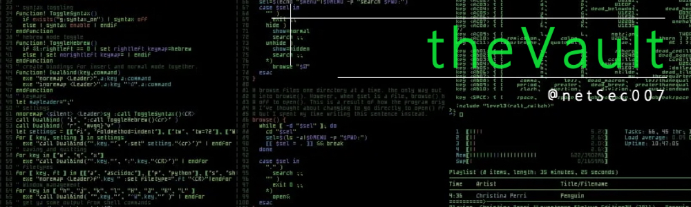

*A curated list of resources for all things dev*

## [Awesome](https://github.com/sindresorhus/awesome)

## Misc Links
* [My Bookmarks](https://sites.google.com/site/bradsbookmarks/home)
* [PacketBlog](https://bcumbia2.wordpress.com)
* [dev.to](https://dev.to)
* [grep.app](https://grep.app)
* [CLI Tools](https://dev.to/lissy93/cli-tools-you-cant-live-without-57f6) - A collection of 50+ CLI Tools.
* [Terminals Are Sezy](https://github.com/k4m4/terminals-are-sexy/blob/master/readme.md)

* [dot files on Git](https://dotfiles.github.io)
* [dot files tutorial](https://github.com/Lissy93/dotfiles)
* [Regex CheatSheet 1](https://cheatography.com/davechild/cheat-sheets/regular-expressions/)
* [Regex Cheatsheet 2](https://www.petefreitag.com/cheatsheets/regex/)
* [Cheatography](https://cheatography.com) - All the Cheatsheets

## Bash

* [.bashrc Generator](https://bashrcgenerator.com)
* [aliases](https://github.com/sebglazebrook/aliases) - Contextual, dynamic, organized aliases for the bash shell.
* [bash-it](https://github.com/Bash-it/bash-it) - Collection of community Bash commands and scripts.
* [bash](https://www.gnu.org/software/bash/) - GNU Project's shell (Bourne Again SHell).
* [bash-powerline](https://github.com/riobard/bash-powerline) - Powerline-style Bash prompt in pure Bash script.
* [bash-sensible](https://github.com/mrzool/bash-sensible) - Attempt at saner Bash defaults.
* [bashtrap](https://github.com/barryclark/bashstrap) - Quick way to spruce up OSX terminal.
* [hstr](https://github.com/dvorka/hstr) - Bash History Suggest Box.
* [liquidprompt](https://github.com/nojhan/liquidprompt) - Full-featured & carefully designed adaptive prompt for Bash & Zsh.
* [zsh](https://www.zsh.org/) - Powerful shell with scripting language.

## Git

* [git-extra-commands](https://github.com/unixorn/git-extra-commands) - Collection of useful extra commands for git
* [bash-git-prompt](https://github.com/magicmonty/bash-git-prompt) - Informative and fancy Bash prompt for Git users.
* [gittify](https://github.com/momeni/gittify) - Colorful Bash prompt + customized Git aliases.
* [oh-my-git](https://github.com/arialdomartini/oh-my-git) - Opinionated git prompt for bash and zsh.
* [sexy-bash-prompt](https://github.com/twolfson/sexy-bash-prompt) - Bash prompt with colors, Git statuses, and Git branches.

## HomeLab

* [theHomeLabWiki](https://thehomelab.wiki)
* [Selh-Hosting-Guide](https://github.com/mikeroyal/Self-Hosting-Guide)
* [Self-hosted Cookbook](https://github.com/tborychowski/self-hosted-cookbook)
* [HomeLabOS](https://homelabos.com/docs/#available-software)
* [NGINX Proxy](https://github.com/NginxProxyManager/nginx-proxy-manager)
* [WireGuard](https://github.com/docker/awesome-compose/tree/master/wireguard)
* [WeeWx](https://weewx.com) - open source weather station.
* [Wetty](https://github.com/butlerx/wetty) - tty over http.
* [Proxmox](https://www.proxmox.com/en/)
* [Home Assistant](https://www.awesome-ha.com/)
* [Homepage](https://gethomepage.dev/en/installation/)
* [MailU](https://mailu.io/) - Self Hosted Mail Server.
* [Homer](self-hosted-cookbook/homer.md at master · tborychowski/self-hosted-cookbook)
* [Network Stack](https://github.com/roachfire/roachlab/tree/main/networking)
* [Glances](https://nicolargo.github.io/glances/)

## Docker

* [Composerize](https://www.composerize.com)
* [LinuxServer.io](https://linuxserver.io)
* [Docker Cheetsheet 1](https://github.com/wsargent/docker-cheat-sheet)
* [Docker Cheetsheet 2](https://github.com/eon01/DockerCheatSheet) - Ultimate Docker Cheetsheet.
* [DockProm](https://github.com/stefanprodan/dockprom) - Docker Container Monitoring.
* [Docker Monitoring](https://github.com/uschtwill/docker_monitoring_logging_alerting) - Container moniotring-grafana,prom etc.

## RasPi

* [Docker on Arm](https://blog.hypriot.com/getting-started-with-docker-on-your-arm-device/)
* [Docker on Arm 2](https://github.com/umiddelb/armhf/wiki/Installing,-running,-using-docker-on-armhf-%28ARMv7%29-devices)
* [Docker on RasPi](https://github.com/umiddelb/armhf/wiki/Get-Docker-up-and-running-on-the-RaspberryPi-%28ARMv6%29-in-three-steps)
* [Headless RasPi](https://www.tomshardware.com/reviews/raspberry-pi-headless-setup-how-to,6028.html)
* [RasPi Docker Enviroment](https://peppe8o.com/setup-a-docker-environment-with-raspberry-pi-os-lite-and-portainer/) - RasPi, Docker and Portainer.
* [Grafana & Prometheus on RasPi](https://ducko.uk/installing-grafana-prometheus-via-docker-to-monitor-raspberry-pi-metrics/)

## Networking

* [IpV6 Reference](https://cdn.comparitech.com/wp-content/uploads/2019/06/Nmap-Cheat-Sheet-1.webp)
* [IPCisco.com](https://ipcisco.com) - Great Cisco Reference Site
* [AnyCast DNS](http://ddiguru.com/blog/anycast-dns-overview)
* [Router/Switch Hardware Guide](https://www.router-switch.com/)
* [TCP and UDP Ports](https://en.wikipedia.org/wiki/List_of_TCP_and_UDP_port_numbers)
* [CIDR Chart](http://www.spiritual-machines.org/CIDR.html)
* [Another CIDR Chart](https://oav.net/mirrors/cidr.html)
* [Subnet Calculator](https://www.subnet-calculator.com/cidr.php)
* [Default Network Timers](https://routerjockey.com/2015/08/10/well-known-intervals)
* [NMAP CheatSheet](https://highon.coffee/blog/nmap-cheat-sheet/)
* [Another NMAP CheatSheet](https://cdn.comparitech.com/wp-content/uploads/2019/06/Nmap-Cheat-Sheet-1.webp)
* [Cisco Bug Search Tool](https://bst.cloudapps.cisco.com/bugsearch)
* [Cisco IOS Master Command Reference](https://www.cisco.com/c/en/us/td/docs/ios-xml/ios/mcl/allreleasemcl/all-book.html)
* [Switchport and Interface Troubleshooting](https://www.cisco.com/c/en/us/support/docs/switches/catalyst-6500-series-switches/12027-53.html)
* [Ciso Campus Design Guide](https://www.cisco.com/c/en/us/td/docs/solutions/CVD/Campus/cisco-campus-lan-wlan-design-guide.html)
* [Firewall.cx](https://www.firewall.cx)
* [PacketLife.net IP Cheatsheets](https://packetlife.net/library/cheat-sheets/)
* [TheNetworkStack](https://thenetworkstack.com)
* [Network Engineering @StackExange](https://networkengineering.stackexchange.com)
* [Router Jockey](https://routerjockey.com)
* [CiscoZine](https://www.ciscozine.com)
* [Cisco Is Easy](https://ciscoiseasy.blogspot.com/2022/08/cisco-is-easy-main.html)
* [Cisco Show Interface Reference](https://networking.ringofsaturn.com/Cisco/showint.php)
* [Ring Of Saturn](https://networking.ringofsaturn.com/Cisco/showint.php)
* [CCNA Routing and Switching Workbook](https://www.freeccnaworkbook.com/workbooks/ccna)

* [Cisco 4500](https://www.cisco.com/c/en/us/support/switches/catalyst-4500-series-switches/series.html)
* [Cisco 6800](https://www.cisco.com/c/en/us/support/switches/catalyst-6800-series-switches/series.html)
* [Cisco 9200](https://www.cisco.com/c/en/us/products/switches/catalyst-9200-series-switches/index.html)
* [Cisco 9300](https://www.cisco.com/c/en/us/products/switches/catalyst-9300-series-switches/index.html)
* [Cisco 9400](https://www.cisco.com/c/en/us/products/switches/catalyst-9400-series-switches/index.html)
* [Cisco 9500](https://www.cisco.com/c/en/us/products/switches/catalyst-9500-series-switches/index.html)
* [Cisco 9600](https://www.cisco.com/c/en/us/products/switches/catalyst-9600-series-switches/index.html)

## Awesome

* [Awesome-selfhosted](https://github.com/awesome-selfhosted/awesome-selfhosted)
* [awesome-shell](https://github.com/alebcay/awesome-shell) - A curated list of awesome command-line frameworks, toolkits, guides and gizmos.
* [awesome-devenv](https://github.com/jondot/awesome-devenv) - Curated list of delightful Bash scripts and resources.
* [awesome-mac](https://github.com/iCHAIT/awesome-macOS) - Awesome list of Macos resources.
* [awesome-status-pages](https://github.com/Netdog007/f-awesome-status-pages)
* [awesome-sysadmin](https://github.com/kahun/awesome-sysadmin) - Curated list of amazingly awesome open source sysadmin resources.
* [Another Awesome sysadmin](https://github.com/awesome-foss/awesome-sysadmin) - awesome-foss
* [awesome-zsh-plugins](https://github.com/unixorn/awesome-zsh-plugins) - Collection of ZSH frameworks, plugins & themes.

## Guides

* [bash-guide](https://github.com/Idnan/bash-guide) - Guide to learn bash.
* [the-art-of-command-line](https://github.com/jlevy/the-art-of-command-line) - Master the command line, in one page.
