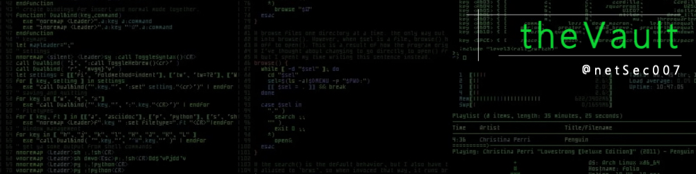

 <A HREF="http://www.InternetTrafficReport.com/">

#  [![GitHub][github-badge]][github] [![Website][website-badge]][website] [![Website4][website-badge4]][website4] [![Website2][website-badge2]][website2] [![Website3][website-badge3]][website3]

[github-badge]: https://img.shields.io/badge/GitHub-black?style=for-the-badge&logoColor=blueviolet&logo=github
[github]: https://github.com/netsec007
[website-badge]: https://img.shields.io/badge/Website-000000?style=for-the-badge&logoColor=blue&logo=microsoftedge
[website]: https://www.slackbluetide.com
[website-badge4]: https://img.shields.io/badge/Email-black?style=for-the-badge&logo=gmail&logoColor=white
[website4]: http://google.com
[website-badge2]: https://img.shields.io/badge/CISCO_GEMS-black?style=for-the-badge&logoColor=brightgreen&logo=cisco
[website2]: https://netsec007.github.io/cisco-gems/
[website-badge3]: https://img.shields.io/badge/CF_Radar-black?style=for-the-badge&logoColor=orange&logo=cloudflare
[website3]: https://radar.cloudflare.com/

## Quick Links

* [My Starred Repos](https://netsec007.github.io/my-awesome-stars/)
* [Cisco Gems](https://netsec007.github.io/cisco-gems/) - Cisco Commands
* [Awesom Self-Hosted](https://awesome-selfhosted.net) - Awesome-selfhosted.net
* [CheatSheets.org](https://www.cheat-sheets.org)
* [ChaptGPT](chat.openai.com)
* [Awesome-ChatGPT](https://github.com/sindresorhus/awesome-chatgpt)
* [theNetworkStack](https://thenetworkstack.com/)
* [StackExchange](https://stackexchange.com/sites)
* [Network Eng/StackExchange](https://networkengineering.stackexchange.com)
* [Awesomeness](https://github.com/sindresorhus/awesome)
* [All Awesome Lists](https://github.com/topics/awesome) - All the Awesome lists on GitHub.
* [Awesome Viewer](https://awesome.digitalbunker.dev) - A visualizer for all of the above Awesome lists.
* [Track Awesome List](https://www.trackawesomelist.com) - View the latest updates of Awesome lists.
* [Cron Cheat Sheet](https://healthchecks.io/docs/cron/)
* [Crontab Guru](https://crontab.guru/every-4-hours)
* [Cron Configuration](https://www.redhat.com/sysadmin/linux-cron-command)
* [Linux Cheat Sheet](https://dev.to/rajani103/linux-cheat-sheet-1ied)
* [Linux Man Pages](https://man7.org/linux/man-pages/index.html)
* [GitHub Markdown](https://docs.github.com/en/get-started/writing-on-github/getting-started-with-writing-and-formatting-on-github/basic-writing-and-formatting-syntax)
* [the book of secret knowledge](https://github.com/trimstray/the-book-of-secret-knowledge)
* [devdocs.io](https://devdocs.io)
* [ShieldsUp](https://www.grc.com/shieldsup) - Internet security vulnerability profiling services
* [Breach Directory](https://breachdirectory.org)
* [HaveIbeenPwned?](https://haveibeenpwned.com)

#### DNS Tools

* [CloudFlare Dashboard](https://dash.cloudflare.com)
* [ShoDan](www.showdan.io) - Internet intelligence
* [CIDR CheetSheet](https://systembash.com/cidr-cheatsheet/)
* [Tcp/ip Ports - IANA](https://www.iana.org/assignments/service-names-port-numbers/service-names-port-numbers.xhtml)
* [ARUL's Network Lookup Utilities](https://aruljohn.com)
* [IP Address Lookup](https://www.ipaddress.com/ip-lookup)
* [MAC Address Lookup](https://maclookup.app)
* [NsLookup.io](https://www.nslookup.io)
* [DNSChecker.org](https://dnschecker.org)
* [Whatsmyip.org Network Tools](https://www.whatsmyip.org)

#### DNS Blocklists

* [Hosts file for ad/spyware blocking](https://someonewhocares.org/hosts/)
* [FireBlog](https://firebog.net) - The BIG Blocklist Collection
* [Dns Blocklists](https://github.com/hagezi/dns-blocklists)
* [oisd.nl](https://oisd.nl) - Another Blocklist

## Misc Links

* [My Bookmarks](https://sites.google.com/site/bradsbookmarks/home)
* [PacketBlog](https://bcumbia2.wordpress.com)
* [ShellCheck](https://www.shellcheck.net)
* [free-for.dev](https://free-for.dev/#/)
* [Medium](https://medium.com)
* [dev.to](https://dev.to)
* [grep.app](https://grep.app)
* [Modern Linux Tools](https://github.com/ibraheemdev/modern-unix)
* [CLI Tools](https://dev.to/lissy93/cli-tools-you-cant-live-without-57f6) - A collection of 50+ CLI Tools.
* [Terminals Are Sezy](https://github.com/k4m4/terminals-are-sexy/blob/master/readme.md)
* [Regex CheatSheet 1](https://cheatography.com/davechild/cheat-sheets/regular-expressions/)
* [Regex Cheatsheet 2](https://www.petefreitag.com/cheatsheets/regex/)
* [VIM Basic Commands](https://m4xshen.me/posts/vim-basic-commands/)
* [Cheatography](https://cheatography.com) - All the Cheatsheets
* [Secure and fast GitHub Pages with CloudFlare](https://blog.cloudflare.com/secure-and-fast-github-pages-with-cloudflare/)
* [AC Outlet/Plug Types](https://www.dropbox.com/s/hahicqyz2n8ibpn/Power%20Plug%20Chart%20and%203560X-3750X%20power%20cable%20Cheatsheet.pdf?dl=0)

## CheatSheets

* [CheatSheets.org](https://www.cheat-sheets.org)
* [Python](https://www.pythoncheatsheet.org/)
* [Markdown](https://www.markdownguide.org/cheat-sheet/)
* [Git](https://education.github.com/git-cheat-sheet-education.pdf)
* [Docker](https://dockerlabs.collabnix.com/docker/cheatsheet/)
* [Linux Directory Structure](https://dev.to/tiffanie_boreux/linux-cheatsheet-directory-structure-and-important-files-paths-4ke6)
* [Linux Command Line](https://cheatography.com/davechild/cheat-sheets/linux-command-line/)
* [Linux Cheat Sheet](https://dev.to/rajani103/linux-cheat-sheet-1ied)
* [RegEx](https://www.rexegg.com/regex-quickstart.html)
* [Linux/Unix Permission](https://www.thegeekdiary.com/linux-file-directory-permissions-cheat-sheet/)
* [ChatGPT](https://quickref.me/chatgpt.html)
* [TheList](https://dev.to/jon_snow789/introducing-50-carefully-curated-cheat-sheets-youll-ever-need-32fj)
* [OverAPI](https://overapi.com) - Collecting All The Cheat Sheets

## Bash/Shell/Terminal

* [awesome-devenv](https://github.com/jondot/awesome-devenv) - Delightful Bash scripts and resources.
* [Awesome-dotfiles](https://github.com/webpro/awesome-dotfiles#readme)
* [awesome-shell](https://github.com/alebcay/awesome-shell) - Awesome command-line frameworks, toolkits, guides and gizmos.
* [awesome-CodeFace](https://github.com/chrissimpkins/codeface#readme) - Terminal Fonts
* [dot files on Git](https://dotfiles.github.io)
* [dot files tutorial](https://github.com/Lissy93/dotfiles)
* [.bashrc Generator](https://bashrcgenerator.com)
* [Oh-My-Bash](https://ohmybash.nntoan.com)
* [aliases](https://github.com/sebglazebrook/aliases) - Contextual, dynamic, organized aliases for the bash shell.
* [bash-it](https://github.com/Bash-it/bash-it) - Community Bash commands and scripts.
* [bash](https://www.gnu.org/software/bash/) - GNU Project's shell (Bourne Again SHell).
* [bash-powerline](https://github.com/riobard/bash-powerline) - Powerline-style Bash prompt in pure Bash script.
* [bash-sensible](https://github.com/mrzool/bash-sensible) - Attempt at saner Bash defaults.
* [bashtrap](https://github.com/barryclark/bashstrap) - Quick way to spruce up OSX terminal.
* [hstr](https://github.com/dvorka/hstr) - Bash History Suggest Box.
* [liquidprompt](https://github.com/nojhan/liquidprompt) - Full-featured & carefully designed adaptive prompt for Bash & Zsh.
* [zsh](https://www.zsh.org/) - Powerful shell with scripting language.

## Git

* [Awesome-GitHub](https://github.com/phillipadsmith/awesome-github#readme)
* [GitHub](https://github.com)
* [GitLab](https://gitlab.com)
* [GitHub readme stats](https://github.com/anuraghazra/github-readme-stats#readme)
* [ReadMe Generator](https://readme.so)
* [git-extra-commands](https://github.com/unixorn/git-extra-commands) - Useful extra commands for git
* [GitHub CheatSheat](https://github.com/tiimgreen/github-cheat-sheet#readme)
* [bash-git-prompt](https://github.com/magicmonty/bash-git-prompt) - Informative and fancy Bash prompt for Git users.
* [gittify](https://github.com/momeni/gittify) - Colorful Bash prompt + customized Git aliases.
* [oh-my-git](https://github.com/arialdomartini/oh-my-git) - Opinionated git prompt for bash and zsh.
* [sexy-bash-prompt](https://github.com/twolfson/sexy-bash-prompt) - Bash prompt with colors, Git statuses, and Git branches.

## HomeLab

* [awesome-self-hosted](https://github.com/awesome-selfhosted/awesome-selfhosted)
* [awesome-status-pages](https://github.com/Netdog007/f-awesome-status-pages)
* [awesom-home-assistant](https://github.com/frenck/awesome-home-assistant#readme)
* [theHomeLabWiki](https://thehomelab.wiki)
* [Self-Hosting-Guide](https://github.com/mikeroyal/Self-Hosting-Guide)
* [Self-hosted Cookbook](https://github.com/tborychowski/self-hosted-cookbook)
* [HomeLabOS](https://homelabos.com/docs/#available-software)
* [NGINX Proxy](https://github.com/NginxProxyManager/nginx-proxy-manager)
* [WireGuard](https://github.com/docker/awesome-compose/tree/master/wireguard)
* [WeeWx](https://weewx.com) - open source weather station.
* [Wetty](https://github.com/butlerx/wetty) - tty over http.
* [Proxmox](https://www.proxmox.com/en/)
* [Home Assistant](https://www.awesome-ha.com/)
* [Homepage](https://gethomepage.dev/en/installation/)
* [MailU](https://mailu.io/) - Self Hosted Mail Server.
* [Homer](self-hosted-cookbook/homer.md at master · tborychowski/self-hosted-cookbook)
* [Network Stack](https://github.com/roachfire/roachlab/tree/main/networking)
* [Glances](https://nicolargo.github.io/glances/)

## Docker

* [Composerize](https://www.composerize.com)
* [LinuxServer.io](https://linuxserver.io)
* [DockerHub](https:dockerhub.com)
* [Docker Cheetsheet 1](https://github.com/wsargent/docker-cheat-sheet)
* [Docker Cheetsheet 2](https://github.com/eon01/DockerCheatSheet) - Ultimate Docker Cheetsheet.
* [DockProm](https://github.com/stefanprodan/dockprom) - Docker Container Monitoring.
* [Docker Monitoring](https://github.com/uschtwill/docker_monitoring_logging_alerting) - Container monitoring-grafana,prom etc.

## RasPi

* [PiCockPit](https://picockpit.com/raspberry-pi/)
* [Docker on Arm](https://blog.hypriot.com/getting-started-with-docker-on-your-arm-device/)
* [Docker on Arm 2](https://github.com/umiddelb/armhf/wiki/Installing,-running,-using-docker-on-armhf-%28ARMv7%29-devices)
* [Docker on RasPi](https://github.com/umiddelb/armhf/wiki/Get-Docker-up-and-running-on-the-RaspberryPi-%28ARMv6%29-in-three-steps)
* [Headless RasPi](https://www.tomshardware.com/reviews/raspberry-pi-headless-setup-how-to,6028.html)
* [RasPi Docker Enviroment](https://peppe8o.com/setup-a-docker-environment-with-raspberry-pi-os-lite-and-portainer/) - RasPi, Docker and Portainer.
* [Grafana & Prometheus on RasPi](https://ducko.uk/installing-grafana-prometheus-via-docker-to-monitor-raspberry-pi-metrics/)

## Networking

* [awesome-security](https://github.com/sbilly/awesome-security#readme)
* [awesome-monitoring](https://github.com/crazy-canux/awesome-monitoring)
* [awesome-sysadmin](https://github.com/kahun/awesome-sysadmin) - Awesome open source sysadmin resources.
* [another awesome sysadmin](https://github.com/awesome-foss/awesome-sysadmin) - awesome-foss
* [awesome-SNMP](https://github.com/eozer/awesome-snmp#readme)
* [LibreNMS Docs](https://docs.librenms.org)
* [IpV6 Reference](https://cdn.comparitech.com/wp-content/uploads/2019/06/Nmap-Cheat-Sheet-1.webp)
* [IPCisco.com](https://ipcisco.com) - Great Cisco Reference Site
* [AnyCast DNS](http://ddiguru.com/blog/anycast-dns-overview)
* [Router/Switch Hardware Guide](https://www.router-switch.com/)
* [TCP and UDP Ports](https://en.wikipedia.org/wiki/List_of_TCP_and_UDP_port_numbers)
* [CIDR Chart](http://www.spiritual-machines.org/CIDR.html)
* [Another CIDR Chart](https://oav.net/mirrors/cidr.html)
* [Subnet Calculator](https://www.subnet-calculator.com/cidr.php)
* [Default Network Timers](https://routerjockey.com/2015/08/10/well-known-intervals)
* [NMAP CheatSheet](https://highon.coffee/blog/nmap-cheat-sheet/)
* [Another NMAP CheatSheet](https://cdn.comparitech.com/wp-content/uploads/2019/06/Nmap-Cheat-Sheet-1.webp)
* [Cisco Bug Search Tool](https://bst.cloudapps.cisco.com/bugsearch)
* [Cisco IOS Master Command Reference](https://www.cisco.com/c/en/us/td/docs/ios-xml/ios/mcl/allreleasemcl/all-book.html)
* [Switchport and Interface Troubleshooting](https://www.cisco.com/c/en/us/support/docs/switches/catalyst-6500-series-switches/12027-53.html)
* [Ciso Campus Design Guide](https://www.cisco.com/c/en/us/td/docs/solutions/CVD/Campus/cisco-campus-lan-wlan-design-guide.html)
* [Firewall.cx](https://www.firewall.cx)
* [PacketLife.net IP Cheatsheets](https://packetlife.net/library/cheat-sheets/)
* [TheNetworkStack](https://thenetworkstack.com)
* [Network Engineering @StackExange](https://networkengineering.stackexchange.com)
* [Router Jockey](https://routerjockey.com)
* [CiscoZine](https://www.ciscozine.com)
* [Cisco Is Easy](https://ciscoiseasy.blogspot.com/2022/08/cisco-is-easy-main.html)
* [Cisco Show Interface Reference](https://networking.ringofsaturn.com/Cisco/showint.php)
* [Ring Of Saturn](https://networking.ringofsaturn.com/Cisco/showint.php)
* [CCNA Routing and Switching Workbook](https://www.freeccnaworkbook.com/workbooks/ccna)

### Cisco Hardware

* [Cisco 4500](https://www.cisco.com/c/en/us/support/switches/catalyst-4500-series-switches/series.html)
* [Cisco 6800](https://www.cisco.com/c/en/us/support/switches/catalyst-6800-series-switches/series.html)
* [Cisco 9200](https://www.cisco.com/c/en/us/products/switches/catalyst-9200-series-switches/index.html)
* [Cisco 9300](https://www.cisco.com/c/en/us/products/switches/catalyst-9300-series-switches/index.html)
* [Cisco 9400](https://www.cisco.com/c/en/us/products/switches/catalyst-9400-series-switches/index.html)
* [Cisco 9500](https://www.cisco.com/c/en/us/products/switches/catalyst-9500-series-switches/index.html)
* [Cisco 9600](https://www.cisco.com/c/en/us/products/switches/catalyst-9600-series-switches/index.html)

## WebDev

* [awesome-web-design](https://github.com/nicolesaidy/awesome-web-design#readme)
* [awesome-Colorful](https://github.com/Siddharth11/Colorful#readme)
* [awesome-CSS](https://github.com/awesome-css-group/awesome-css#readme)
* [awesome-CSS-Learning](https://github.com/micromata/awesome-css-learning#readme)
* [awesome-fonts](https://github.com/brabadu/awesome-fonts#readme)
* [dashboard-icons](https://github.com/walkxcode/dashboard-icons/blob/main/ICONS.md)
* [icon-buddy](https://iconbuddy.app/logos)
* [w3schools](https://www.w3schools.com/default.asp) - Learn Web Code
* [ColorsAndFonts](https://www.colorsandfonts.com)
* [design resources for developers](https://github.com/bradtraversy/design-resources-for-developers)
* [Jekyll](https://jekyllrb.com)
* [Jekyll Style Guide](https://ben.balter.com/jekyll-style-guide/)
* [Mozilla Web Resources](https://developer.mozilla.org/en-US/docs/Web)

## Awesome

* [awesome-self-hosted](https://github.com/awesome-selfhosted/awesome-selfhosted)
* [awesome-shell](https://github.com/alebcay/awesome-shell) - Awesome command-line frameworks, toolkits, guides and gizmos.
* [awesome-devenv](https://github.com/jondot/awesome-devenv) - Delightful Bash scripts and resources.
* [Awesome-ChatGPT](https://github.com/sindresorhus/awesome-chatgpt)
* [awesome-mac](https://github.com/iCHAIT/awesome-macOS) - Awesome list of MacOs resources.
* [awesome-status-pages](https://github.com/Netdog007/f-awesome-status-pages)
* [awesome-sysadmin](https://github.com/kahun/awesome-sysadmin) - Awesome open source sysadmin resources.
* [another awesome sysadmin](https://github.com/awesome-foss/awesome-sysadmin) - awesome-foss
* [awesome-zsh-plugins](https://github.com/unixorn/awesome-zsh-plugins) - Collection of ZSH frameworks, plugins & themes.
* [awesome ansible](https://github.com/ansible-community/awesome-ansible#readme)
* [awesome-web-design](https://github.com/nicolesaidy/awesome-web-design#readme)
* [awesome-ReadMe](https://github.com/matiassingers/awesome-readme#readme) - ReadMe
* [awesome-Colorful](https://github.com/Siddharth11/Colorful#readme)
* [awesome-SNMP](https://github.com/eozer/awesome-snmp#readme)
* [awesome-security](https://github.com/sbilly/awesome-security#readme)
* [awesome-CSS](https://github.com/awesome-css-group/awesome-css#readme)
* [awesome-CSS-Learning](https://github.com/micromata/awesome-css-learning#readme)
* [awesome-fonts](https://github.com/brabadu/awesome-fonts#readme)
* [awesome-CodeFace](https://github.com/chrissimpkins/codeface#readme) - Terminal Fonts
* [awesome-Docker](https://github.com/veggiemonk/awesome-docker#readme)
* [awesome-CloudFlare](https://github.com/irazasyed/awesome-cloudflare#readme)
* [awesom-home-assistant](https://github.com/frenck/awesome-home-assistant#readme)
* [awesome-RasPi](https://github.com/thibmaek/awesome-raspberry-pi#readme)
* [awesome-monitoring](https://github.com/crazy-canux/awesome-monitoring)
* [awesome-moniotring-2](http://canuxcheng.com/awesome-monitoring/)

## Guides

* [bash-guide](https://github.com/Idnan/bash-guide) - Guide to learn bash.
* [the-art-of-command-line](https://github.com/jlevy/the-art-of-command-line) - Master the command line, in one page.
* 
